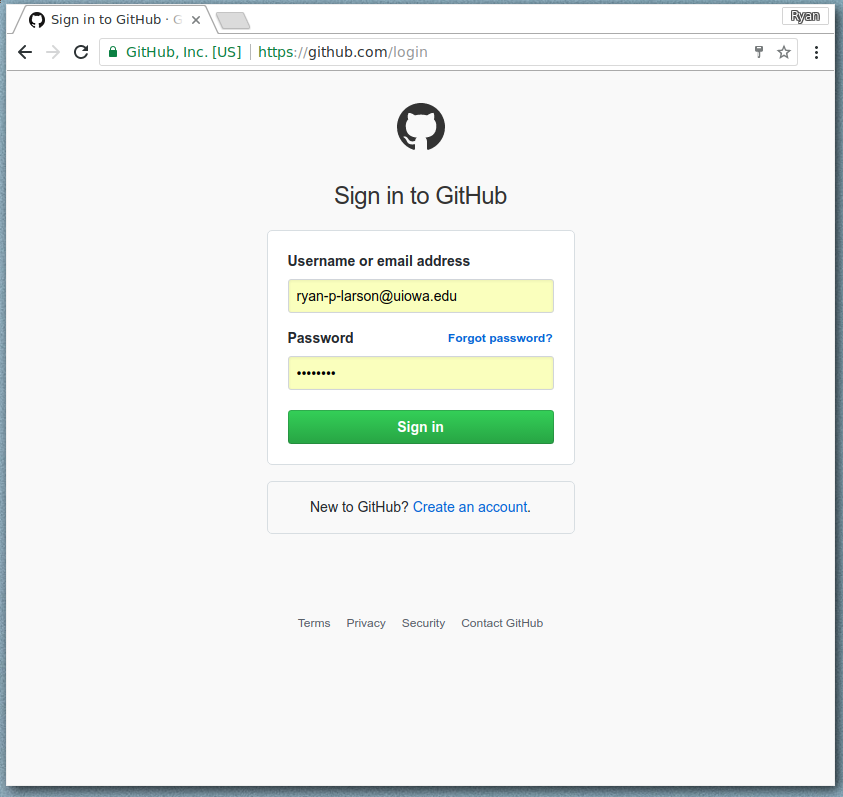
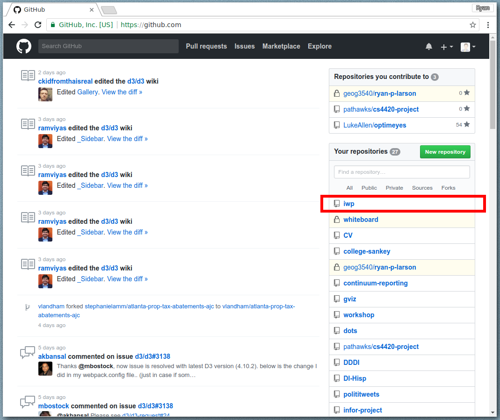
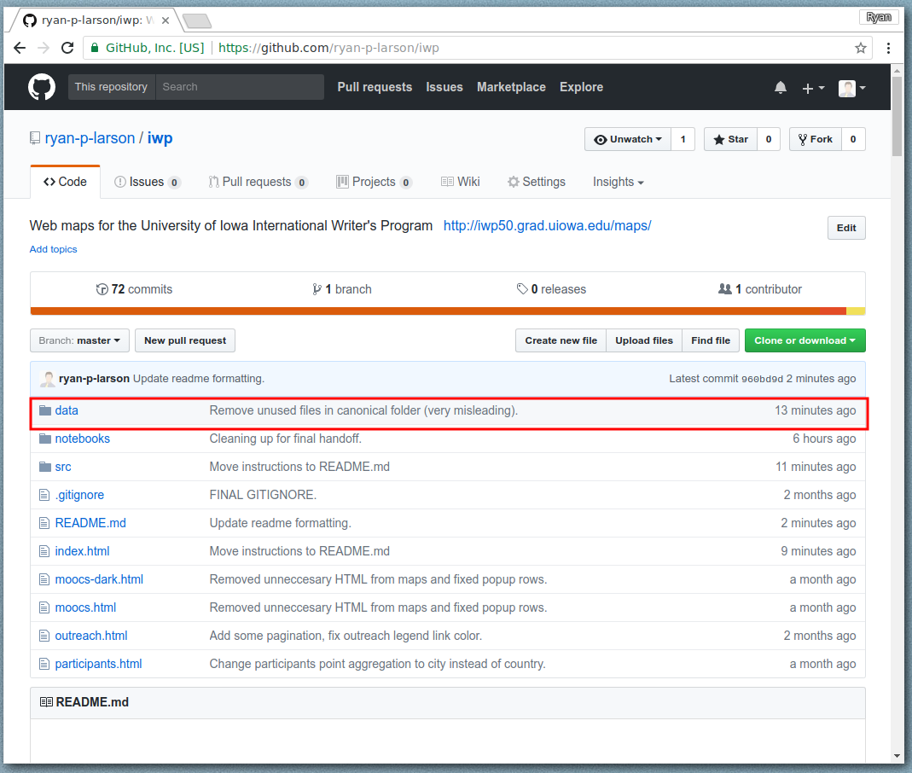
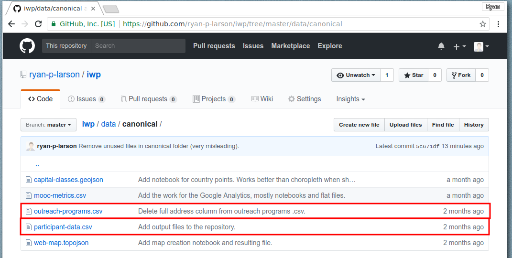
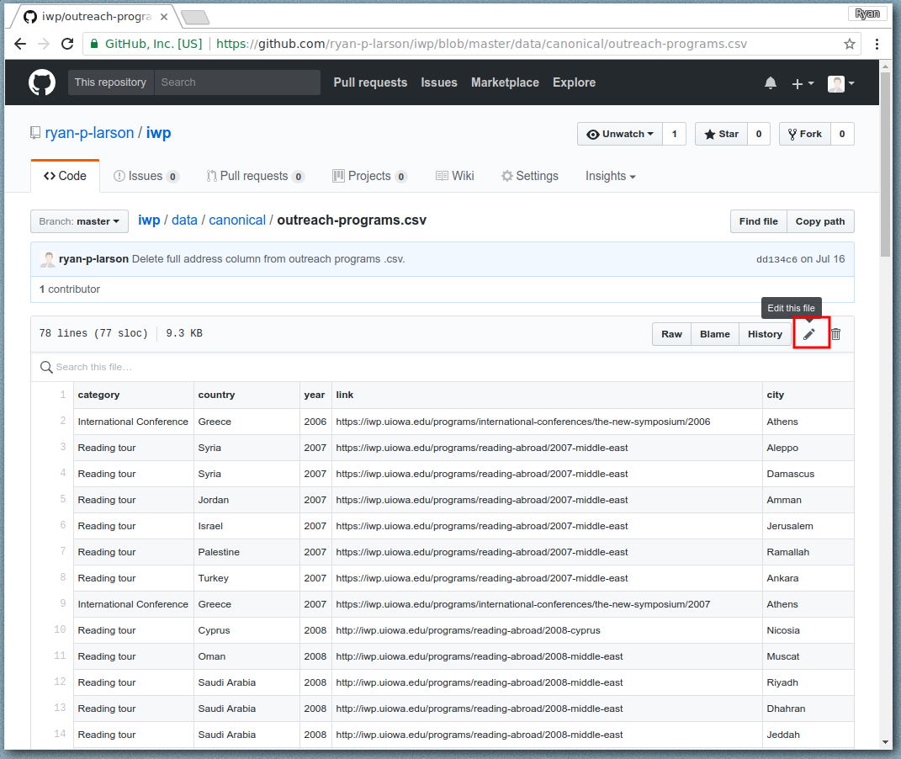
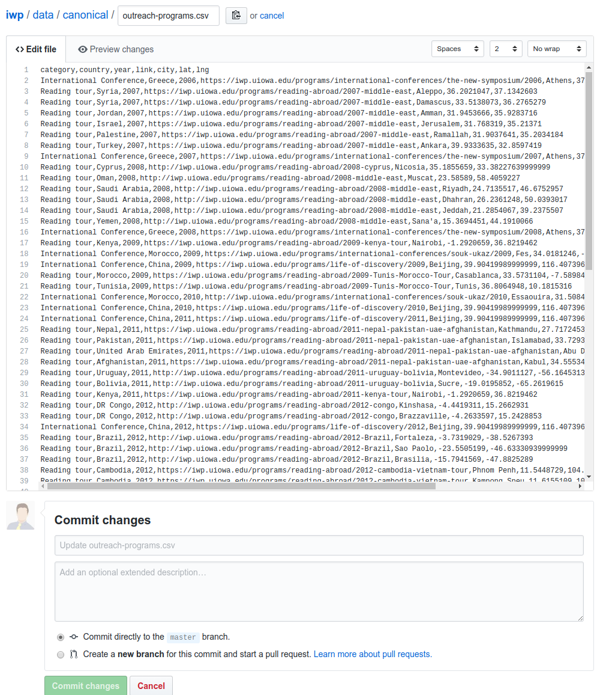
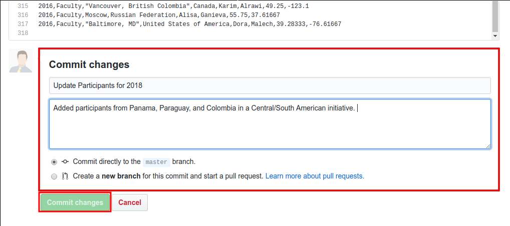

# International Writers Program Mapping Project

See the live maps ***[here!](https://ryan-p-larson.github.io/iwp)***

### Table of Contents
- Files
  - [File Directory](#FDT)
  - [Map Dependencies](#MDP)
  - Data File Headers
- [Maps & Functionality](#MF)
  - Outreach Programs Map
  - Youth Participants Map
  - MOOC Map
- Updating Maps Guide

<hr>

### Files

There's a lot of files in this repository, some are more important than others. This documentation will serve as a guide while updating the web maps in the future.

**<a name="FDT"></a>File Directory Tree.** Below is an overview of the repository's files and folders, commented to describe their purpose.
```
.
├── data/                     # Contains all data
│   ├── canonical/            # Data used in the live web maps
│   ├── ga/                   # Data from Google Analytics to create MOOC map
│   ├── maps/                 # Country/capital/population data used to create maps
│   └── original/             # Original data received from IWP
│
├── notebooks/                # Folder to store data manipulation and work
│
├── src/                      # Folder holding the source files to render maps
│   └── instructions/         # Images used in the instructions file
│
├── index.html
├── INSTRUCTIONS.md           # This file
├── moocs-dark.html           # MOOC Map (Dark version)
├── moocs.html                # MOOC Map (Light version)
├── outreach.html             # Outreach Programs Map
├── participants.html         # Youth Participants Map
└── README.md                 # Github 'homepage' file
```

<br>

**<a name="MDP"></a>Map - File Dependencies.** Each map renders from a specific data file, each map's dependencies are shown in the table below.

| Map | File | File Description |
|---|---|---|
| Overseas Outreach | `data/canonical/outreach-programs.csv` | A `.csv` file of Outreach programs by year |
| Overseas Outreach | `data/canonical/web-map.topojson` | Base web map used to generate countries and locate capitals if necessary. |
| Youth Programs | `data/canonical/participant-data.csv` | A `.csv` file with program participants and their attributes. |
| Youth Programs | `data/canonical/web-map.topojson` | Base web map used to generate countries and locate capitals if necessary. |
| MOOC Map | `data/canonical/capital-classes.geojson` | Formatted file from Google Analytics, containing the # of new users, total page views, and unique page views for each of the six IWP MOOC's. |

<br>

##### Data File Headers

The following tables will describe the map data attributes. This is to be used as a reference for updating and developing the web maps.

**Outreach Programs Data:** `data/canonical/outreach-programs.csv`

| Attribute | Description | Type |
|---|---|---|
| Category | Type of program, dependent on the context in which the program's work was done. | String: `Reading Tour`, `International Tour`, `Silk Routes`, `Distance Learning` |
| Country | Country the program took place in. For countries that don't exist, use the latest nationally recognized boundaries. | String: `United States of America`, `...` |
| Year | Year program took place in. | Int: `2008-2017` |
| Link | HTML URL containing the programs information. | String: `https://iwp.uiowa.edu/programs/reading-abroad/...` |
| City | City program took place in. | String: `New York` |
| lat | Latitude of city, country. | Float: `40.1791857` |
| lng | Longitude of city, country. | Float: `40.44.4991029`|

**Youth Participants Data:** `data/canonical/participant-data.csv`

| Attribute | Description | Type |
|---|---|---|
| Year |
year,status,city,country,first_name,last_name,lat,long


<hr>

### Maps Functionality

**Outreach Programs Map:**
</img>

A map displaying all of the IWP's Outreach programs; each program is it's own circle marker on the map. The programs are colored according to their type. Additionally, *the map legend includes links* to read about each program in more detail.
</img>

The map also includes a *filtering functionality*, as demonstrated in the following.
</img>

**Youth Participants Map:**
</img>

The user can select a program to inspect it's details. For programs that have occurred in the same place, pagination is included. The same pagination is included in the Outreach Programs Map.
</img>

**MOOC Map:**
</img>

**Methodology.** The data displayed has been downloaded and transformed from Google Analytics. Because of the more custom requirements, this map won't be easily update-able. To recreate the query, follow these instructions:
1. Create a new sheet in the Google Analytics web application.
2. Set date range to all.
3. Click on the filter button...
4. Exclude the United States. `WHERE Country IS NOT EQUAL TO 'The United States'`
5. Select the following attributes to display in your sheet: `page-title, country, date(year), total_page_views, unique_page_views, new_users`
6. Groupby the year column, and sum the three numeric attributes `total_page_views, unique_page_views, new_users`.

**Data Attribute Handbook.** See the file data headers above.

<hr>

### Updating Maps

1. Log in to [Github](https://www.github.com/login) under the account that owns the IWP Repository.


2. From your homepage or using the direct URL, navigate to the `iwp` repository homepage.


3. Enter the `data/canonical/` folder in the Github directory to access the map data files.


4. *Important!* These are the only two files you will update. These two files are responsible for the data displayed on the webmaps.


5. Click a file to see it individually, click the edit icon from this view to edit a file.


6. *Important!* How you order and input the updated data is critical! *Add your rows to the bottom*
  - Each row is one 'record', separated by commas, and ending with a new line carriage return (enter)
  - The attributes must be put in the order of the columns
  - There can be no skipped columns, if the attribute is blank include a comma for it's column: `Name,,Last Name`.
  - Fields with commas contained in them must be escaped by double quoting the characters: `"New York, NY"`.
  - **E.G.** `Reading tour, Saudi Arabia, 2008, https://www.uiowa.edu/..., Riyadh`


7. Each batch of changes is wrapped up in a 'commit'. Enter in the summary of your changes and any other notes. This will be helpful if you want to see your changes over time. Enter your details into the editor's commit and submit your changes. You're done!

