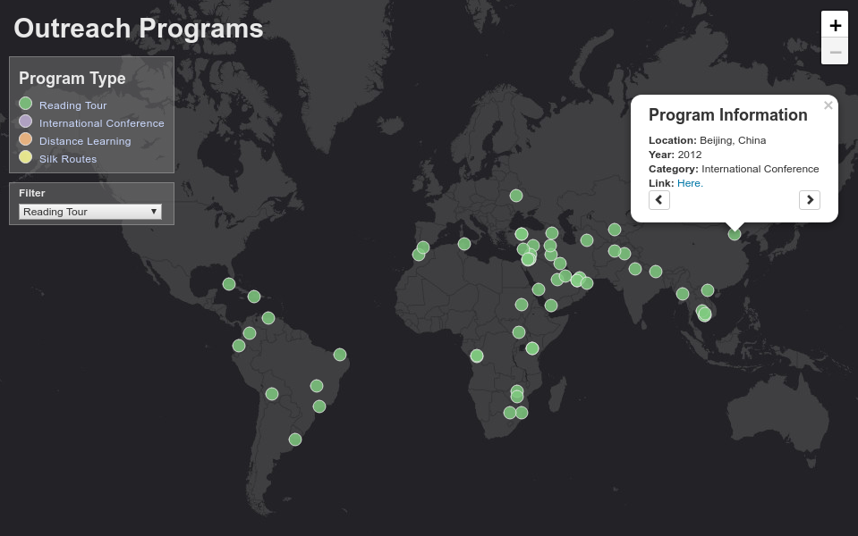
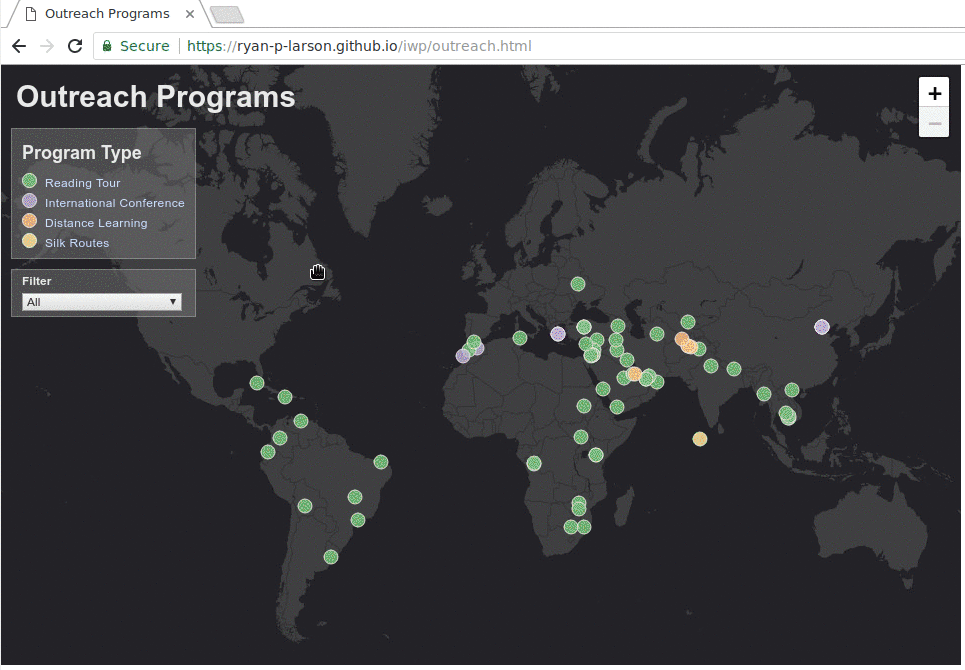
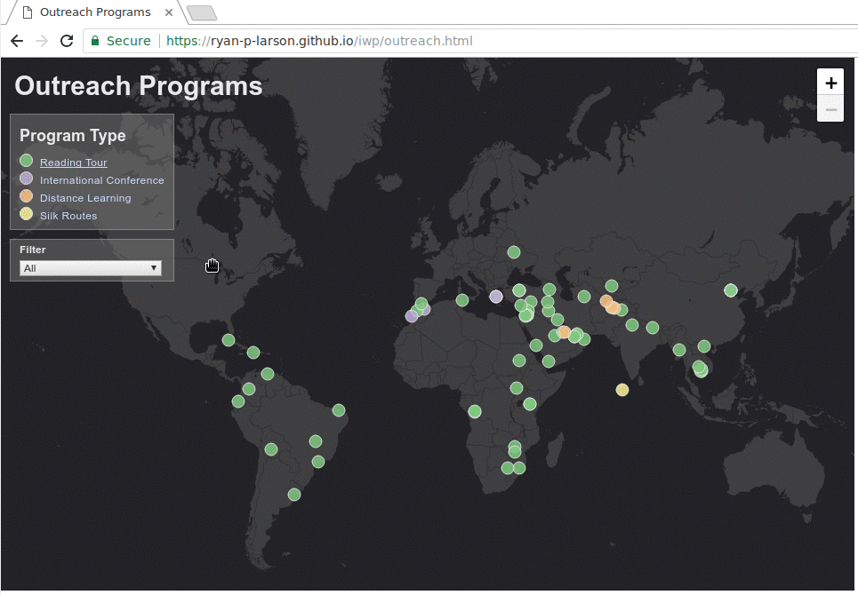
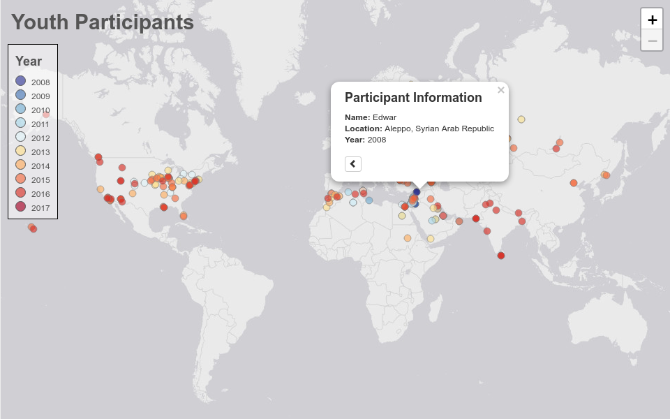
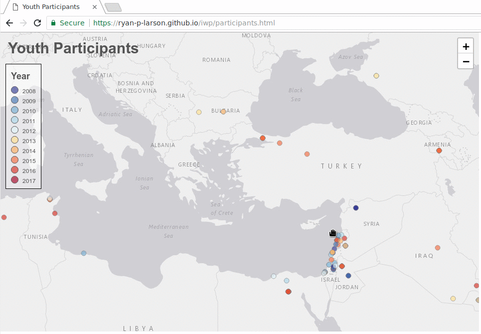
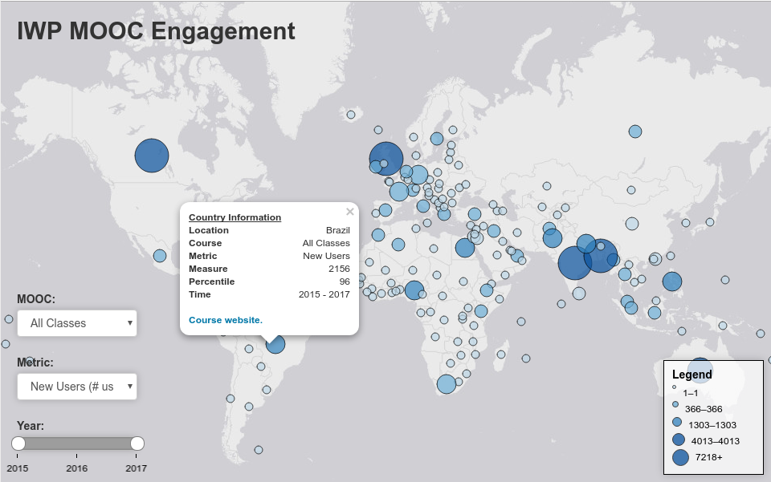

# International Writers Program Mapping Project

See the live maps [***here!***](https://ryan-p-larson.github.io/iwp) 


### Table of Contents
1. Files
  - [File Directory](#FDT)
  - [Map Dependencies](#MDP)
2. [Map Functionality](#MF)
  - Outreach Programs Map
  - Youth Participants Map
  - MOOC Map
3. Updating Maps


### Files

There's a lot of files in this repository, some are more important than others. This documentation will serve as a guide while updating the web maps in the future.

**<a name="FDT"></a>File Directory Tree.** Below is an overview of the repository's files and folders, commented to describe their purpose.
```
.
├── data/                     # Contains all data
│   ├── canonical/            # Data used in the live web maps
│   ├── ga/                   # Data from Google Analytics
│   ├── maps/                 # Map data used in creating maps
│   └── original/             # Original data received from IWP
│
├── notebooks/                # Folder to store data manipulation and work
│
├── src/                      # Folder holding the source files to render maps
│   └── instructions/         # Images used in the instructions file
│
├── index.html
├── INSTRUCTIONS.md           # This file
├── moocs-dark.html           # MOOC Map (Dark version)
├── moocs.html                # MOOC Map (Light version)
├── outreach.html             # Outreach Programs Map
├── participants.html         # Youth Participants Map
└── README.md                 # Github 'homepage' file
```

**<a name="MDP"></a>Map - File Dependencies.** Each map renders from a specific data file, each map's dependencies are shown in the table below.

| Map | File | File Description |
|---|---|---|
| Overseas Outreach | `data/canonical/outreach-programs.csv` | A `.csv` file of Outreach programs by year |
| Overseas Outreach | `data/canonical/web-map.topojson` | Base web map used to generate countries and locate capitals if necessary. |
| Youth Programs | `data/canonical/participant-data.csv` | A `.csv` file with program participants and their attributes. |
| Youth Programs | `data/canonical/web-map.topojson` | Base web map used to generate countries and locate capitals if necessary. |
| MOOC Map | `data/canonical/capital-classes.geojson` | Formatted file from Google Analytics, containing the # of new users, total page views, and unique page views for each of the six IWP MOOC's. |

**Data File Headers.**


### Maps Functionality

**Outreach Programs Map:**
</img>

A map displaying all of the IWP's Outreach programs; each program is it's own circle marker on the map. The programs are colored according to their type. Additionally, *the map legend includes links* to read about each program in more detail.
</img>

The map also includes a *filtering functionality*, as demonstrated in the following.
</img>

**Youth Participants Map:**
</img>

The user can select a program to inspect it's details. For programs that have occurred in the same place, pagination is included. The same pagination is included in the Outreach Programs Map.
</img>

**MOOC Map:**
</img>


# TO-DO
- list all of the functions for each map
- gifs for important Functions

- Table out the attributes for the map data

- Mooc map
  - google analytics explanation
  - metrics explanation

- update maps
  - explain (only outreach + youth can be updated)
  - process (after transferring to github)
    1. Login into Github
    2. navigate to correct file (include quick map dependency)
    3. Edit the files (include the absolutely critical caveats: "", lat/lng)
    4. git commit
